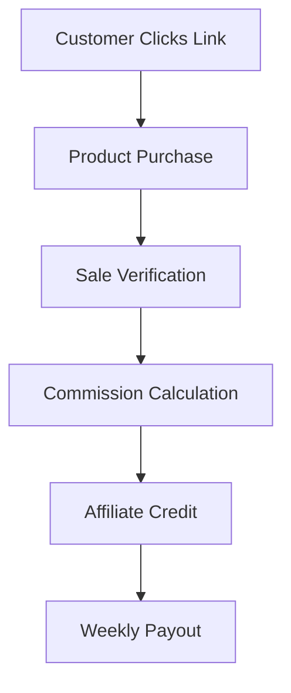
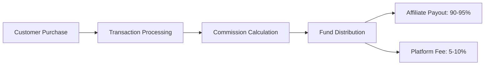

This is a [Next.js](https://nextjs.org) project bootstrapped with [`create-next-app`](https://nextjs.org/docs/pages/api-reference/create-next-app).

## Getting Started

First, run the development server:

```bash
npm run dev
```

## 📚 Development Guide

### Code Style
- ESLint configuration
- Prettier setup
- TypeScript strict mode
- Husky pre-commit hooks

### Branch Strategy
```
main           # Production branch
├── staging    # Pre-production testing
├── develop    # Development branch
└── feature/*  # Feature branches
```

### Commit Convention
```
feat: Add new feature
fix: Bug fix
docs: Documentation changes
style: Code style changes
refactor: Code refactoring
test: Test changes
chore: Build changes
```

## 🎨 Component Libraries & Resources

### UI Components
- [Shadcn/ui](https://ui.shadcn.com/)
- [Radix UI](https://www.radix-ui.com/)
- [HeadlessUI](https://headlessui.dev/)

### Design Resources
- [Figma Community](https://www.figma.com/community)
- [Heroicons](https://heroicons.com/)
- [unDraw](https://undraw.co/)

### Development Tools
- [Postman](https://www.postman.com/)
- [TablePlus](https://tableplus.com/)
- [VS Code Extensions](https://marketplace.visualstudio.com/)

## 🚢 Deployment

### Production Deployment
1. Vercel deployment setup
2. Environment configuration
3. Database migration
4. SSL certification

### Monitoring
- Error tracking
- Performance monitoring
- User analytics
- Server metrics

## 🧪 Testing

### Testing Strategy
- Unit tests (Jest)
- Integration tests
- E2E tests (Cypress)
- Performance testing

### Test Coverage
- Components: 80%
- API routes: 90%
- Utils: 95%

## 🗺️ Future Roadmap

### Phase 1 (Q1 2024)
- [ ] MVP launch
- [ ] Basic affiliate tracking
- [ ] Payment integration

### Phase 2 (Q2 2024)
- [ ] Advanced analytics
- [ ] API documentation
- [ ] Mobile optimization

### Phase 3 (Q3 2024)
- [ ] Mobile app
- [ ] AI features
- [ ] Marketplace integration

## 🤝 Contributing

1. Fork the repository
2. Create your feature branch
3. Commit your changes
4. Push to the branch
5. Create a Pull Request

## 📚 Resources & References

### Documentation
- [Next.js Documentation](https://nextjs.org/docs)
- [Prisma Documentation](https://www.prisma.io/docs)
- [Tailwind CSS](https://tailwindcss.com/docs)

### Learning Resources
- [Next.js Learn](https://nextjs.org/learn)
- [TypeScript Handbook](https://www.typescriptlang.org/docs/)
- [React Query Course](https://ui.dev/react-query)

### Community
- [Discord Server](#)
- [GitHub Discussions](#)
- [Stack Overflow](#)

## 📄 License

This project is licensed under the MIT License - see the [LICENSE.md](LICENSE.md) file for details.

---

Built with ❤️ using Next.js and modern web technologies.

## 🔧 Technical Implementation Details

### Affiliate Approval System

#### Automatic Approval Criteria
- Minimum social media following:
  - Instagram: 1,000+ followers
  - Twitter/X: 1,000+ followers
  - YouTube: 500+ subscribers
  - TikTok: 1,000+ followers
- OR Professional credentials:
  - Verified business email
  - Active business website
  - LinkedIn profile with 500+ connections
- OR Content creation history:
  - Active blog with 1,000+ monthly visitors
  - Newsletter with 500+ subscribers
  - Podcast with 200+ listeners

#### Verification Process
1. **Initial Application**
   - Basic information collection
   - Social media profile links
   - Website/content platform URLs
   - Audience demographics

2. **Automated Checks**
   - Social media API verification
   - Domain authority checking
   - Email domain verification
   - Spam/fraud detection

3. **Scoring System**
   - Points allocated based on criteria
   - Minimum score required: 50/100
   - Automatic approval if score > 70
   - Manual review if score 50-70
   - Automatic rejection if score < 50

4. **Probation Period**
   - 30-day initial probation
   - Must generate minimum 10 clicks
   - At least 1 successful conversion
   - No fraud/spam activities

#### Rejection Criteria
- Fake/bought followers
- Suspicious traffic patterns
- Inappropriate content history
- Previous platform violations
- Incomplete/false information

#### Appeal Process
- 30-day waiting period after rejection
- Must show improvement in lacking areas
- Additional documentation may be required
- One-time appeal opportunity

### Campaign Structure

#### Pay Per Sale (PPS) Model
- Commission based on successful sales only
- 5-10% platform fee on each transaction
- Real-time sales tracking
- Transparent commission calculation
- Instant sale notification system

#### Campaign Features
1. **Commission Settings**
   - Percentage-based commission
   - Automatic fee calculation
   - Clear earnings breakdown
   - Transaction history tracking

2. **Sale Verification**
   - Real-time purchase validation
   - Fraud detection system
   - Refund handling
   - Chargeback protection

3. **Tracking System**
   - Unique tracking links
   - Custom UTM parameters
   - Click fraud detection
   - IP tracking protection
   - Conversion verification
   - Deep linking support

4. **Reporting**
   - Sales performance metrics
   - Conversion rates
   - Revenue analytics
   - Commission summaries
   - Payment history

#### Future Campaign Types
- Pay Per Click (PPC) - Future addition
- Pay Per Lead (PPL) - Future addition
- Custom Campaigns - Based on demand

### Sales Flow


### Transaction Flow


## 📚 Technical Documentation

### API Documentation

#### Authentication Endpoints
```typescript
/**
 * @route POST /api/auth/register
 * @desc Register a new user
 * @access Public
 */
interface RegisterRequest {
  email: string;
  password: string;
  name: string;
  role: 'creator' | 'affiliate' | 'admin';
}

/**
 * @route POST /api/auth/login
 * @desc Authenticate user & get token
 * @access Public
 */
interface LoginRequest {
  email: string;
  password: string;
  remember?: boolean;
}

/**
 * @route GET /api/auth/me
 * @desc Get user data
 * @access Private
 */
interface UserResponse {
  id: string;
  email: string;
  name: string;
  role: string;
  settings: UserSettings;
}
```

#### Campaign Management
```typescript
/**
 * @route POST /api/campaigns
 * @desc Create a new campaign
 * @access Private
 */
interface CreateCampaignRequest {
  name: string;
  description: string;
  commissionType: 'fixed' | 'percentage';
  commissionValue: number;
  startDate?: Date;
  endDate?: Date;
  rules?: CampaignRule[];
  targetAudience?: TargetAudience;
}

/**
 * @route GET /api/campaigns/analytics/:id
 * @desc Get campaign analytics
 * @access Private
 */
interface CampaignAnalytics {
  clicks: number;
  conversions: number;
  revenue: number;
  conversionRate: number;
  timeframe: 'daily' | 'weekly' | 'monthly';
}
```

### Affiliate Tracking
- Cookie duration: 30 days (industry standard)
- First-click attribution model
- Cross-device tracking support
- Transparent tracking dashboard
- Real-time conversion tracking

### Cookie Policy
- Clear disclosure to users
- GDPR and privacy law compliant
- Option to opt-out
- Regular cookie cleanup
- Secure storage implementation

### Attribution Rules
- Last-click attribution
- 30-day lookback window
- Cross-device attribution
- Multiple touchpoint tracking
- Commission split for multiple affiliates:
  - First referrer: 60%
  - Last referrer: 40%

### Tracking Features
- Unique tracking links
- Custom UTM parameters
- Click fraud detection
- IP tracking protection
- Conversion verification
- Deep linking support

### Database Schema Details

#### User Management
```prisma
model User {
  id            String    @id @default(cuid())
  email         String    @unique
  name          String?
  password      String
  role          Role      @default(AFFILIATE)
  status        Status    @default(ACTIVE)
  emailVerified DateTime?
  image         String?
  createdAt     DateTime  @default(now())
  updatedAt     DateTime  @updatedAt

  profile       Profile?
  accounts      Account[]
  sessions      Session[]
  campaigns     Campaign[]
  affiliateInfo Affiliate?
}

model Profile {
  id          String  @id @default(cuid())
  userId      String  @unique
  bio         String?
  website     String?
  company     String?
  phoneNumber String?
  address     Json?
  settings    Json?

  user User @relation(fields: [userId], references: [id], onDelete: Cascade)
}

model Account {
  id                String  @id @default(cuid())
  userId            String
  type              String
  provider          String
  providerAccountId String
  refresh_token     String? @db.Text
  access_token      String? @db.Text
  expires_at        Int?
  token_type        String?
  scope             String?
  id_token          String? @db.Text
  session_state     String?

  user User @relation(fields: [userId], references: [id], onDelete: Cascade)

  @@unique([provider, providerAccountId])
}
```

#### Affiliate System
```prisma
model Affiliate {
  id               String    @id @default(cuid())
  userId           String    @unique
  status           Status    @default(PENDING)
  commissionRate   Float?
  payoutThreshold  Float     @default(50)
  totalEarnings    Float     @default(0)
  availableBalance Float     @default(0)
  paymentMethod    String?
  paymentDetails   Json?
  createdAt        DateTime  @default(now())
  updatedAt        DateTime  @updatedAt

  user      User       @relation(fields: [userId], references: [id])
  campaigns Campaign[]
  referrals Referral[]
  payouts   Payout[]
}

model Campaign {
  id              String   @id @default(cuid())
  name            String
  description     String?
  commissionType  String
  commissionValue Float
  startDate       DateTime @default(now())
  endDate         DateTime?
  status          Status   @default(ACTIVE)
  rules           Json?
  creatorId       String
  createdAt       DateTime @default(now())
  updatedAt       DateTime @updatedAt

  creator    User        @relation(fields: [creatorId], references: [id])
  affiliates Affiliate[]
  referrals  Referral[]
}
```

### Product Types & Commission Structure

#### Supported Products
1. **Digital Products**
   - Software licenses
   - Digital courses
   - Downloads
   - Digital assets
   
2. **Subscription Services**
   - SaaS products
   - Membership plans
   - Recurring services
   
3. **Combination Products**
   - Bundle offerings
   - Package deals
   - Hybrid solutions

#### Commission Handling
1. **One-Time Purchases**
   - Instant commission calculation
   - One-time payout
   - 5-10% platform fee

2. **Subscription-Based**
   - Recurring commission structure
   - Monthly/Annual tracking
   - Commission on renewals
   - Lifetime customer tracking

3. **Bundle Sales**
   - Split commission calculation
   - Product-specific rates
   - Package deal bonuses

#### Tracking Implementation
```typescript
interface ProductType {
  type: 'digital' | 'subscription' | 'bundle';
  commissionType: 'one-time' | 'recurring';
  recurringDuration?: 'monthly' | 'annual';
  platformFee: number; // 5-10%
  isLifetime: boolean;
}

interface CommissionStructure {
  baseRate: number;
  recurringRate?: number;
  bundleBonus?: number;
  minimumPayout: number; // $20
  payoutFrequency: 'weekly';
}
```

### State Management

#### Zustand Store Types
```typescript
interface AuthStore {
  user: User | null;
  isAuthenticated: boolean;
  loading: boolean;
  error: string | null;
  login: (credentials: LoginCredentials) => Promise<void>;
  logout: () => Promise<void>;
  register: (userData: RegisterData) => Promise<void>;
  resetPassword: (email: string) => Promise<void>;
  updateProfile: (data: ProfileUpdateData) => Promise<void>;
}

interface CampaignStore {
  campaigns: Campaign[];
  selectedCampaign: Campaign | null;
  loading: boolean;
  error: string | null;
  fetchCampaigns: () => Promise<void>;
  createCampaign: (data: CreateCampaignData) => Promise<void>;
  updateCampaign: (id: string, data: UpdateCampaignData) => Promise<void>;
  deleteCampaign: (id: string) => Promise<void>;
  selectCampaign: (campaign: Campaign) => void;
}

interface AnalyticsStore {
  data: AnalyticsData | null;
  timeframe: TimeFrame;
  loading: boolean;
  error: string | null;
  fetchAnalytics: (params: AnalyticsParams) => Promise<void>;
  updateTimeframe: (timeframe: TimeFrame) => void;
  exportData: (format: ExportFormat) => Promise<void>;
}
```

### Component Architecture

#### Reusable Components
```typescript
// components/ui/Button/Button.tsx
interface ButtonProps extends React.ButtonHTMLAttributes<HTMLButtonElement> {
  variant?: 'primary' | 'secondary' | 'ghost';
  size?: 'sm' | 'md' | 'lg';
  loading?: boolean;
  icon?: React.ReactNode;
}

// components/ui/Modal/Modal.tsx
interface ModalProps {
  isOpen: boolean;
  onClose: () => void;
  title: string;
  size?: 'sm' | 'md' | 'lg';
  children: React.ReactNode;
  footer?: React.ReactNode;
}

// components/ui/Table/Table.tsx
interface TableProps<T> {
  data: T[];
  columns: TableColumn<T>[];
  loading?: boolean;
  pagination?: PaginationProps;
  onSort?: (column: string) => void;
  onRowClick?: (row: T) => void;
}
```

### API Integration

#### Axios Configuration
```typescript
// lib/axios.ts
import axios from 'axios';

const api = axios.create({
  baseURL: process.env.NEXT_PUBLIC_API_URL,
  timeout: 10000,
  headers: {
    'Content-Type': 'application/json',
  },
});

api.interceptors.request.use((config) => {
  const token = localStorage.getItem('token');
  if (token) {
    config.headers.Authorization = `Bearer ${token}`;
  }
  return config;
});

api.interceptors.response.use(
  (response) => response,
  async (error) => {
    if (error.response?.status === 401) {
      // Handle token refresh or logout
    }
    return Promise.reject(error);
  }
);
```

### Error Handling

#### Global Error Boundary
```typescript
// components/ErrorBoundary.tsx
class ErrorBoundary extends React.Component<
  { children: React.ReactNode },
  { hasError: boolean; error: Error | null }
> {
  constructor(props: { children: React.ReactNode }) {
    super(props);
    this.state = { hasError: false, error: null };
  }

  static getDerivedStateFromError(error: Error) {
    return { hasError: true, error };
  }

  componentDidCatch(error: Error, errorInfo: React.ErrorInfo) {
    console.error('Error caught by boundary:', error, errorInfo);
    // Send to error reporting service
  }

  render() {
    if (this.state.hasError) {
      return <ErrorFallback error={this.state.error} />;
    }
    return this.props.children;
  }
}
```

### Performance Optimization

#### Image Component
```typescript
// components/ui/Image/Image.tsx
interface OptimizedImageProps {
  src: string;
  alt: string;
  width?: number;
  height?: number;
  priority?: boolean;
  quality?: number;
  className?: string;
  onLoad?: () => void;
  onError?: () => void;
}

const OptimizedImage: React.FC<OptimizedImageProps> = ({
  src,
  alt,
  width,
  height,
  priority = false,
  quality = 75,
  className,
  onLoad,
  onError,
}) => {
  return (
    <Image
      src={src}
      alt={alt}
      width={width}
      height={height}
      priority={priority}
      quality={quality}
      className={className}
      onLoad={onLoad}
      onError={onError}
      loading={priority ? 'eager' : 'lazy'}
    />
  );
};
```

### Security Measures

#### CSRF Protection
```typescript
// middleware.ts
import { csrf } from '@/lib/csrf';

export async function middleware(req: NextRequest) {
  // CSRF protection for mutation endpoints
  if (['POST', 'PUT', 'DELETE'].includes(req.method)) {
    const csrfToken = req.headers.get('x-csrf-token');
    if (!csrfToken || !csrf.verify(csrfToken)) {
      return new NextResponse(
        JSON.stringify({ error: 'Invalid CSRF token' }),
        { status: 403 }
      );
    }
  }
}
```

### Monitoring & Analytics

#### Performance Monitoring
```typescript
// lib/monitoring.ts
interface PerformanceMetrics {
  fcp: number; // First Contentful Paint
  lcp: number; // Largest Contentful Paint
  fid: number; // First Input Delay
  cls: number; // Cumulative Layout Shift
  ttfb: number; // Time to First Byte
}

const captureWebVitals = (metric: any) => {
  const metrics: PerformanceMetrics = {
    fcp: 0,
    lcp: 0,
    fid: 0,
    cls: 0,
    ttfb: 0,
  };

  switch (metric.name) {
    case 'FCP':
      metrics.fcp = metric.value;
      break;
    case 'LCP':
      metrics.lcp = metric.value;
      break;
    case 'FID':
      metrics.fid = metric.value;
      break;
    case 'CLS':
      metrics.cls = metric.value;
      break;
    case 'TTFB':
      metrics.ttfb = metric.value;
      break;
  }

  // Send to analytics service
  sendToAnalytics(metrics);
};
```

## 🔄 CI/CD Pipeline

### GitHub Actions Workflow
```yaml
# .github/workflows/main.yml
name: CI/CD

on:
  push:
    branches: [ main, develop ]
  pull_request:
    branches: [ main, develop ]

jobs:
  test:
    runs-on: ubuntu-latest
    steps:
      - uses: actions/checkout@v2
      - name: Setup Node.js
        uses: actions/setup-node@v2
        with:
          node-version: '18'
      - name: Install dependencies
        run: npm ci
      - name: Run tests
        run: npm test
      - name: Run lint
        run: npm run lint

  deploy:
    needs: test
    if: github.ref == 'refs/heads/main'
    runs-on: ubuntu-latest
    steps:
      - uses: actions/checkout@v2
      - name: Deploy to Vercel
        uses: amondnet/vercel-action@v20
        with:
          vercel-token: ${{ secrets.VERCEL_TOKEN }}
          vercel-org-id: ${{ secrets.ORG_ID}}
          vercel-project-id: ${{ secrets.PROJECT_ID}}
          vercel-args: '--prod'
